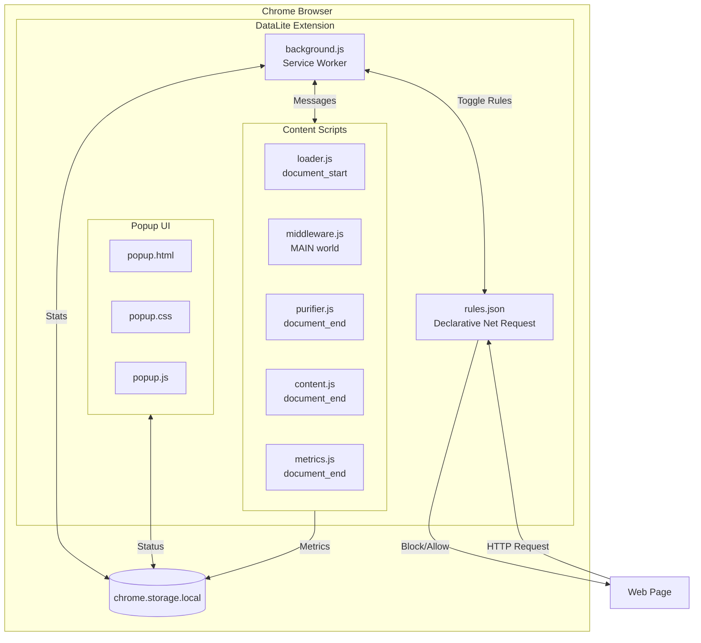
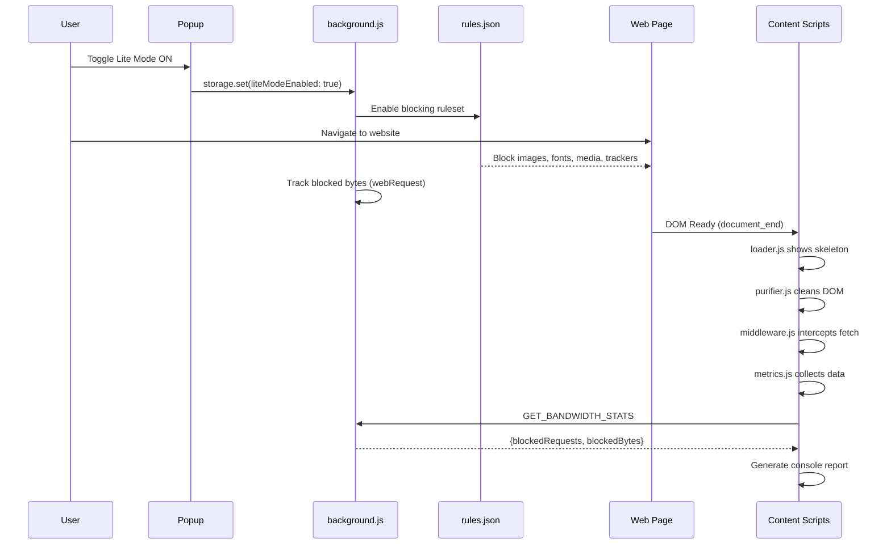
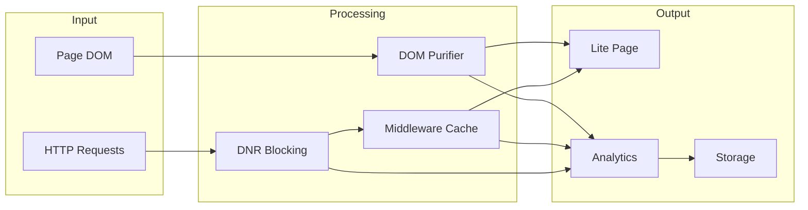

# DataLite Portal - Architecture

## Overview

DataLite Portal is a Chrome Extension (Manifest V3) that optimizes browsing by blocking heavy resources, compressing content, and providing real-time analytics.

---

## System Architecture



---

## Request Flow



---

## Component Details

### 1. Background Service Worker (`background.js`)

| Responsibility | Implementation |
|----------------|----------------|
| DNR Rule Toggle | `updateEnabledRulesets()` |
| Bandwidth Tracking | `webRequest.onCompleted` |
| Blocked Stats | `onRuleMatchedDebug` callback |
| Message Hub | `runtime.onMessage` |
| Lifetime Stats | `storage.local` aggregation |

### 2. Declarative Net Request (`rules.json`)

**12 Blocking Rules:**
- Images (except CAPTCHA)
- Fonts, Media, Objects
- Analytics & Trackers
- Social Widgets
- CSS CDNs
- Video Embeds
- Chat Widgets
- Cookie Banners

### 3. Content Scripts

| Script | Run At | World | Purpose |
|--------|--------|-------|---------|
| `loader.js` | document_start | ISOLATED | Show skeleton loader |
| `middleware.js` | document_start | MAIN | Intercept fetch, cache, compress |
| `purifier.js` | document_end | ISOLATED | Clean DOM (Hard/Soft mode) |
| `content.js` | document_end | ISOLATED | Bridge popup ↔ content |
| `metrics.js` | document_end | ISOLATED | Collect & report analytics |

### 4. Purifier Modes

```
┌─────────────────────────────────────────────────────────┐
│                    cleanHTML()                          │
│                         │                               │
│         ┌───────────────┴───────────────┐               │
│         ▼                               ▼               │
│   ┌─────────────┐               ┌─────────────┐         │
│   │  Hard Mode  │               │  Soft Mode  │         │
│   │ Rebuild DOM │               │  Hide Media │         │
│   │ Static Sites│               │ ASP.NET/SPA │         │
│   └─────────────┘               └─────────────┘         │
└─────────────────────────────────────────────────────────┘
```

### 5. Metrics Pipeline

```
PerformanceObserver ──► FP, FCP, LCP, Long Tasks
Resource Timing API ──► transferSize, decodedBodySize
background.js ────────► blockedRequests, blockedBytes
purifier.js ──────────► DOM blocked count
         │
         ▼
    console.table() + Lifetime Storage
```

---

## Data Flow



---

## File Structure

```
datalite-portal/
├── manifest.json          # Extension config
├── background.js          # Service worker
├── rules.json             # DNR blocking rules
├── content.js             # Popup bridge
├── purifier.js            # DOM cleaner
├── purifier.css           # Lite mode styles
├── middleware.js          # Fetch interceptor
├── metrics.js             # Analytics
├── loader.js              # Skeleton UI
├── loader.css             # Skeleton styles
└── popup/
    ├── popup.html         # Toggle UI
    ├── popup.css          # Dark theme
    └── popup.js           # Toggle logic
```

---

## Storage Schema

```javascript
chrome.storage.local = {
    liteModeEnabled: boolean,
    totalBlockedItems: number,
    lifetimeBlockedRequests: number,
    lifetimeBlockedBytes: number,
    sessionCount: number,
    lastUpdated: timestamp
}
```
