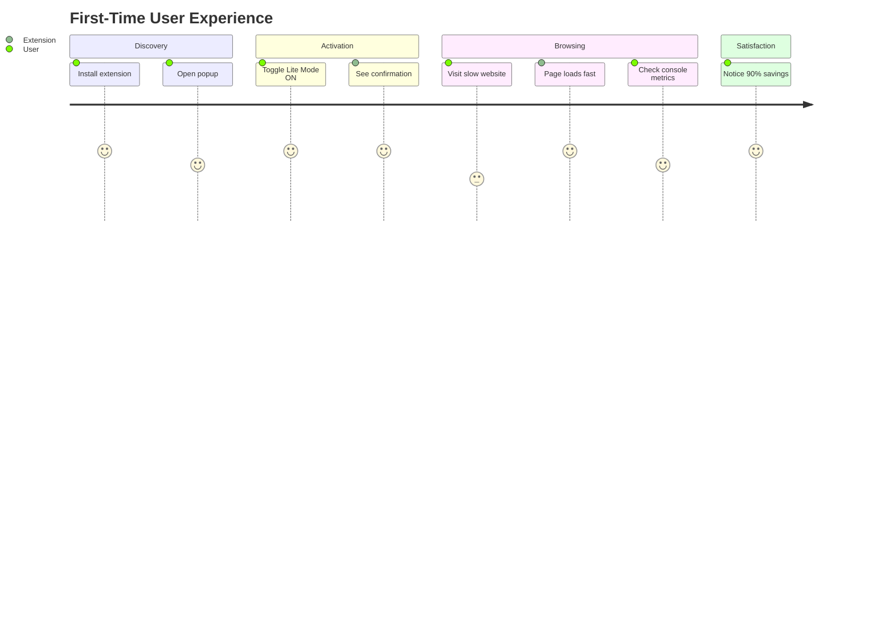
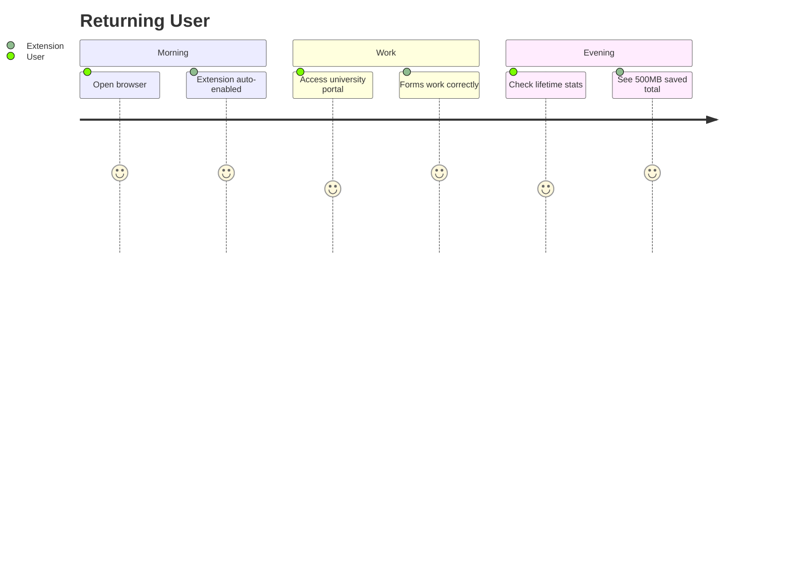

# DataLite Portal - Use Cases

## Primary Use Cases

### 1. Low Bandwidth Networks
**Scenario**: User on 2G/3G mobile data or slow rural connection.

| Without DataLite | With DataLite |
|------------------|---------------|
| 4.5 MB page load | 400 KB page load |
| 15s load time | 2s load time |
| Images timeout | Text loads instantly |

**Flow**:
1. User enables Lite Mode
2. DNR blocks images, fonts, videos
3. Page loads with text content only
4. User reads content without waiting

---

### 2. Limited Data Plans
**Scenario**: User with 1GB/month mobile data cap.

**Without DataLite**: Browsing 20 pages = ~100MB consumed
**With DataLite**: Browsing 20 pages = ~10MB consumed

**Savings**: 90% data reduction

---

### 3. University Portal Access (GIET ERP)
**Scenario**: Student checking attendance on gietuerp.in during slow campus WiFi.

```
┌─────────────────────────────────────────┐
│  User visits gietuerp.in                │
│              ↓                          │
│  DataLite detects ASP.NET WebForms      │
│              ↓                          │
│  Soft Mode activates (preserves forms)  │
│              ↓                          │
│  Blocks: logos, banners, social icons   │
│  Keeps: login form, data tables         │
│              ↓                          │
│  User logs in successfully              │
└─────────────────────────────────────────┘
```

---

### 4. Content-Heavy News Sites
**Scenario**: Reading news articles with heavy ads and media.

**Blocked**:
- Auto-play videos
- Tracking scripts (Google Analytics, Facebook Pixel)
- Ad networks (DoubleClick, AdSense)
- Cookie consent banners
- Social share widgets

**Result**: Clean, fast, text-focused reading experience.

---

### 5. Developer Debugging
**Scenario**: Developer analyzing page performance.

**Metrics Provided**:
```
┌────────────────────┬─────────────┐
│ 🌐 Network         │ 4G          │
│ 🚫 Blocked         │ 47 requests │
│ 📊 Original        │ 4.2 MB      │
│ 📦 Lite Mode       │ 312 KB      │
│ 💚 Saved           │ 92.6%       │
│ ⚡ FCP             │ 0.82s       │
│ 🎯 TTI             │ 2.10s       │
└────────────────────┴─────────────┘
```

---

## User Journeys

### Journey 1: First-Time User



### Journey 2: Daily User



---

## Edge Cases Handled

| Scenario | Detection | Action |
|----------|-----------|--------|
| CAPTCHA forms | `id/class contains 'captcha'` | Whitelist from blocking |
| ASP.NET sites | `__doPostBack` detection | Use Soft Mode |
| Login pages | `/login`, `/auth` in URL | Preserve all forms |
| React/Vue SPAs | Framework detection | Soft Mode |
| Offline browsing | Cache API | Serve cached content |
